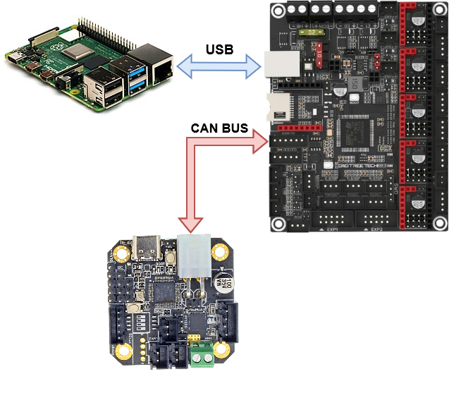
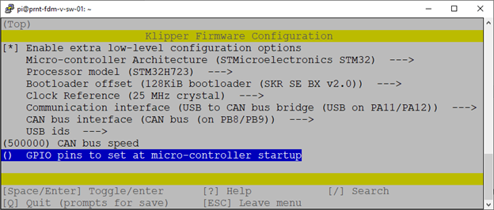
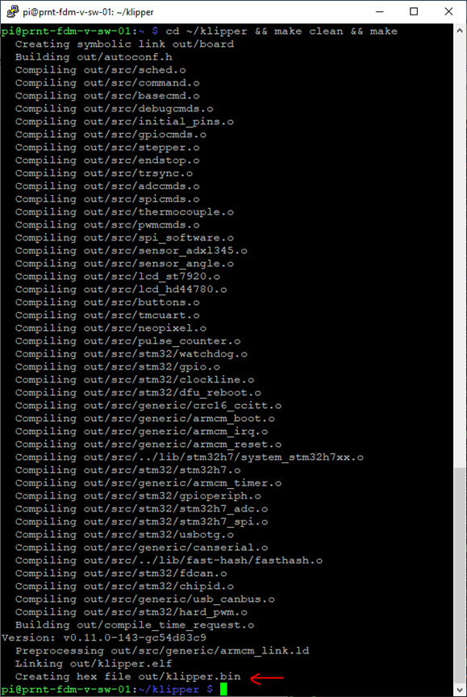
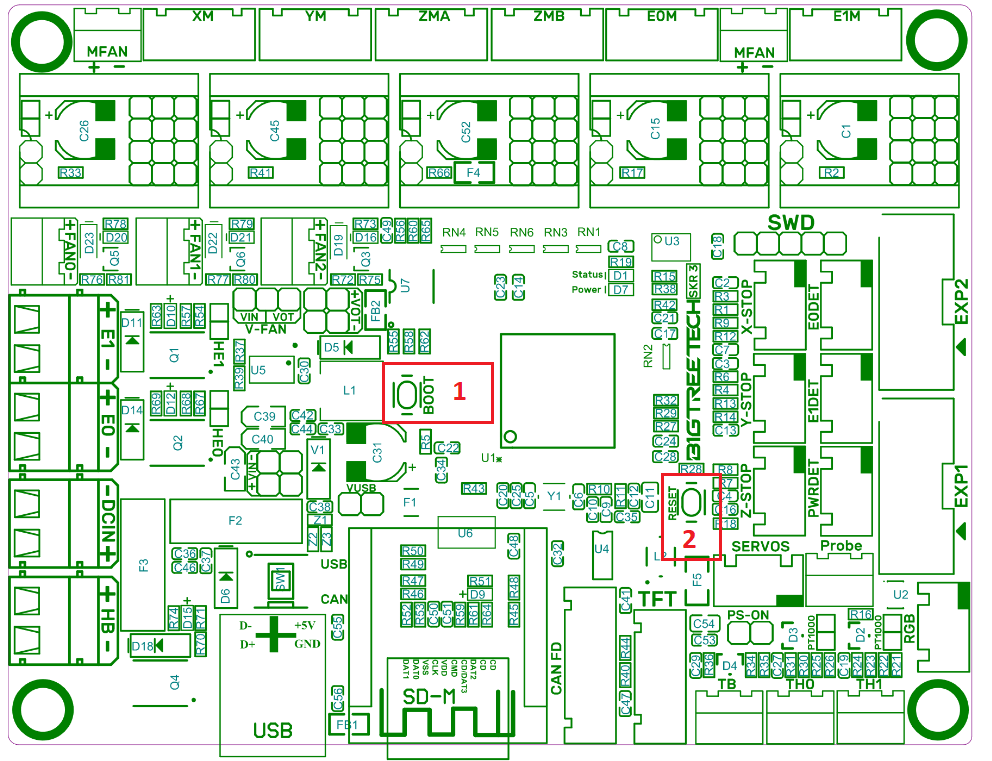
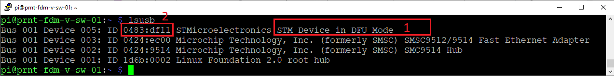
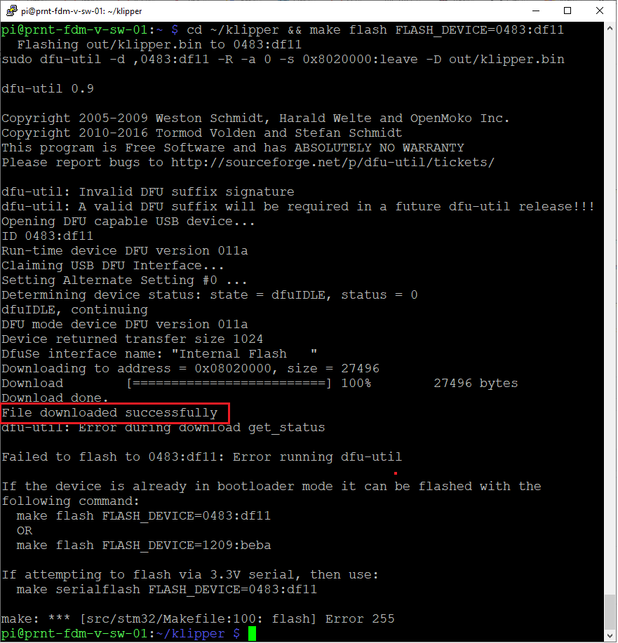
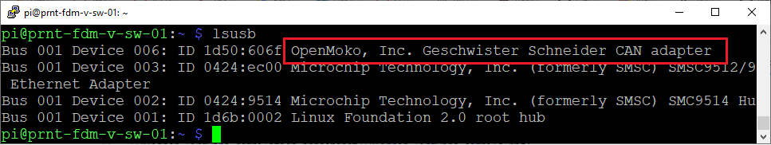
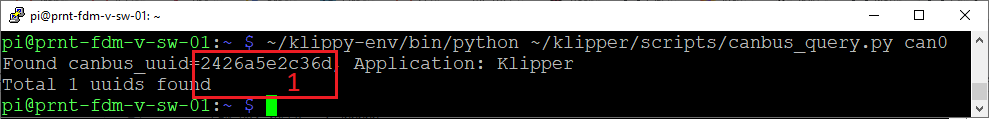

# Використання usb to can bridge режиму klipper на прикладі SKR3 + встановлення firmware через DFU
[USB to CAN bridge режим кліперу](https://www.klipper3d.org/CANBUS.html#usb-to-can-bus-bridge-mode) перемикає використання serial протоколу на використання CAN протоколу взаємодії хост системи з платою керування, надає можливість підключення додаткових пристоїв (таких як [EBB36/42](https://github.com/bigtreetech/EBB)), котрі працюють за допомогою CAN інтерфейсу, якщо головна плата керування має CAN інтерфейс (така як [SKR3](https://github.com/bigtreetech/SKR-3)).



Такий варіант підключення надає можливість обійтись без використання додаткових CAN-адаптерів. Використання CAN інтерфейсу для доступу лише до плати керування сенсу не має.


## Термінологія
- *Хост система* – комп’ютер, raspberryPi, на котрому встановлено klipper
- *Плата керування* – пристрій до котрого підключенні виконуючі пристрої принтеру, такі як крокові двигуни, термодатчки тощо, в данному випадку – SKR3
- *Firmware* – мікрокод, що встановлюється в плату керування
## Пререквізити
- Користувач володіє впевненими навиками використання *nix like os через термінал
- Встановлено Raspberry Pi OS
- Встановлений kiauh, та за його допомогою klipper 
- Для підключення плати керування до хост системи використовується serial інтерфейс (USB)
- Принтер успішно друкує
## Послідовність дій
+ Увімкнення підтримки can-інтерфейсу в хост системі
+ Оновлення klipper
+ Конфігурація firmware
+ Компіляція firmware
+ Встановлення firmware
+ Конфігурація klipper
### Увімкнення підтримки can-інтерфейсу в хост системі
1. В файл `/etc/network/interfaces.d/can0` хост ситеми встановити вміст:
   ```
   allow-hotplug can0
   iface can0 can static
     bitrate 500000
     up ifconfig $IFACE txqueuelen 1024
   ```
2. Перезавантажити хост систему командою `reboot`
### Оновлення klipper
Cлід оновими вміст кодової бази klipper в використанням git команд або kiauh.
Опис використання git чи kiauh виходить за межі поточної інструкції.
### Конфігурація firmware
1.	Запустити програму конфігурації firmware виконавши `cd ~/klipper && make menuconfig` команду
2.	Виконати конфігурацію згідно значень:
    - *Enable extra low-level configuration options* -> YES
    - *Micro-controller Architecture* -> STMicroelectronics STM32
    - *Processor model* -> STM32H723 )
    - *Bootloader offset* -> 128KiB bootloader (SKR SE BX v2.0)
    - *Clock Reference* -> 25 MHz crystal
    - *Communication interface* -> USB to CAN bus bridge (USB on PA11/PA12)
    - *CAN bus interface* -> CAN bus (on PB8/PB9)
    - *USB ids* -> USB serial number from CHIPID
    - *CAN bus speed* -> 500000
    - *GPIO pins to set at micro-controller startup* -> [пустий рядок]

    
    
    ***Важливо***  впевнитись, що на платі керування встановлено саме STM32H723 мікроконтролер, інакше значення портів інтерфейсів можуть відрізнятись.
3. Натиснути символ `Q`, та підтвердити необхідність збереження натиснувши `Y`, у вікні, що з’явиться.
### Компіляція firmware
Запустити програму компіляції firmware виконавши `cd ~/klipper && make clean && make` команду.



Ідентифікатором успішного завершення буде наявність `Creating hex file out/klipper.bin` рядку і вікні терміналу.

### Встановлення firmware

Можливе встановлення за допомогою флеш карти, але більш цікавим варіантом є використання DFU режиму, опис котрого приведено далі.

1. Перевести плату керування в DFU режим натиснувши `BOOT` (1) кнопку, та втримуючи її натиснути та відпустити `RESET` (2) кнопку, відпустити `BOOT` (1) кнопку
   
2. Перевірки увімкнення DFU режиму виконавши в консолі `lsusb` команду впевнитись в наявності рядку з текстом `STM Device in DFU Mode` (1)
   
3. Встановити firmware виконавши команду `cd ~/klipper && make flash FLASH_DEVICE=0483:df11`, де `0483:df11` - USB ідентифікатор UDF пристрою отриманий на попередньому кроці (2)
   
   Результатом успішного встановлення буде наявність `File downloaded successfully` рядку.
4. Перевірити успішність встановлення виконавши команду `lsusb` та знайшовши у відповіді рядок котрий містить `OpenMoko, Inc. Geschwister Schneider CAN adapter` текст
   

### Конфігурація klippy

1. Визначити can ідентифікатор плати керування (1) виконавши команду `$ ~/klippy-env/bin/python ~/klipper/scripts/canbus_query.py can0`
   
2. Використовуючи веб інтерфейс mainsail в файлі `printer.cfg`, в розділі `[mcu]` видалити (або закоментувати) поточне значення `serial` (1) та додати `canbus_uuid: 2426a5e2c36d`, де 2426a5e2c36d - can ідентифікатор плати керування визначений на попередньому кроці
   
4. Натиснувши `Save and Restart` зберегти зміни та перезавантажити klippy насолоджуватись роботою через can bus (;
